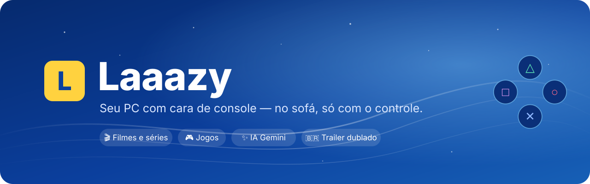
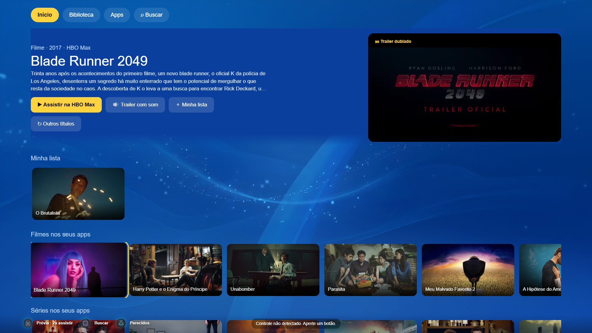
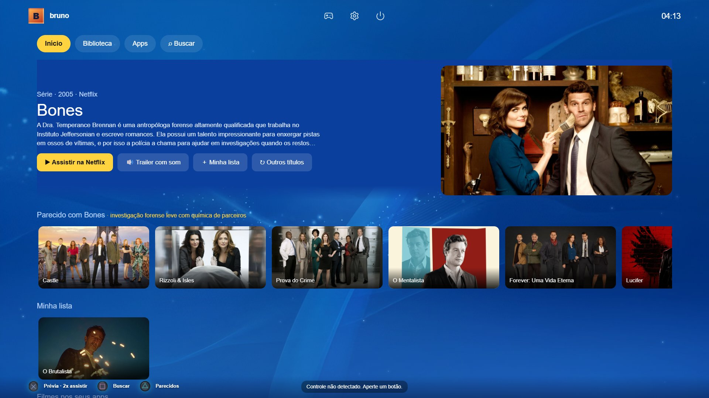
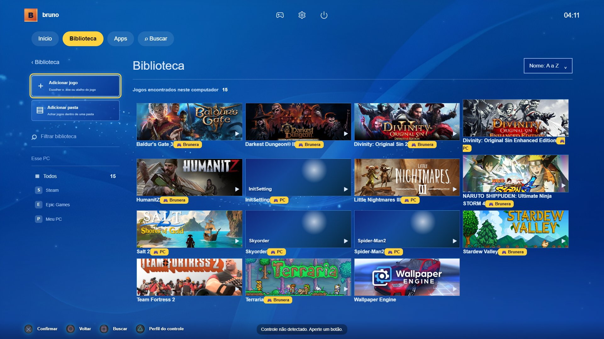
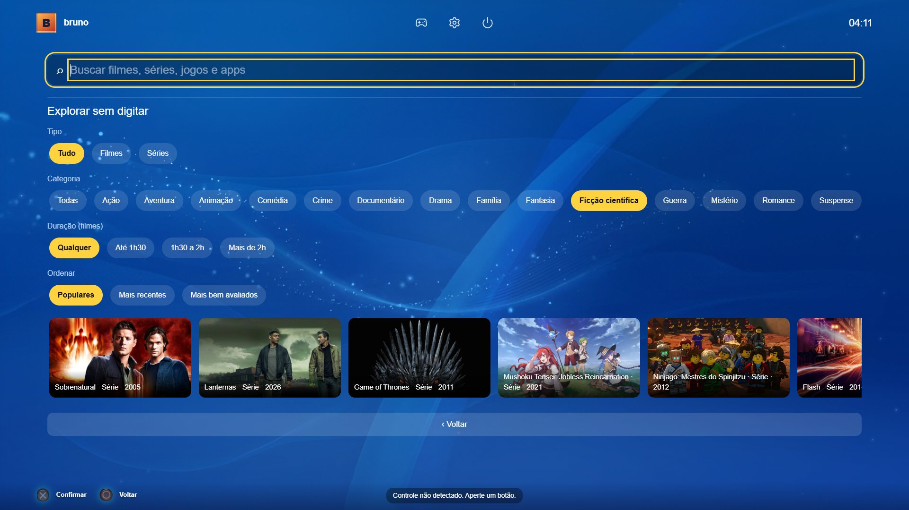
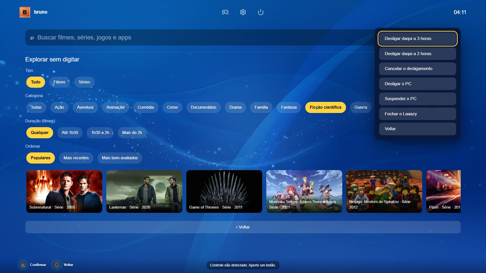
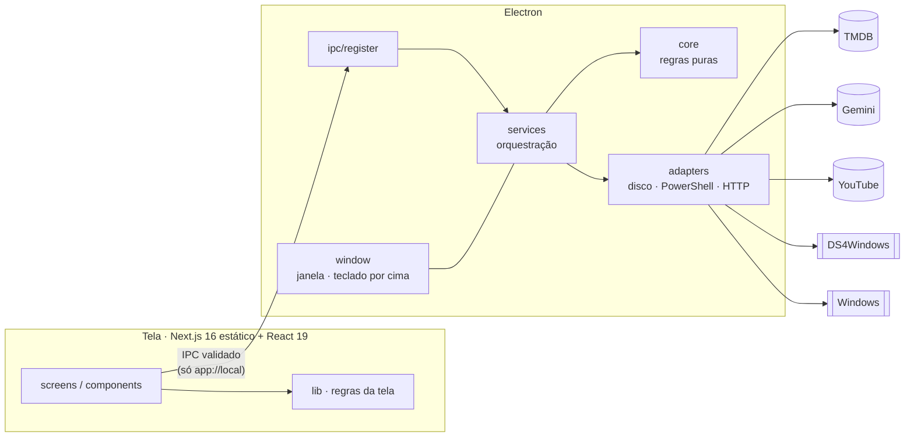

<div align="center">



<br>


-47848F?logo=electron&logoColor=white)


**Uma central de mídia para Windows pensada para o sofá:** filmes, séries, animes, jogos e apps<br>
numa tela só, com cara de console e controlada inteira pelo **DualShock 4**.

[Recursos](#-recursos) · [Telas](#-telas) · [Controle](#-no-controle) · [Como rodar](#-como-rodar) · [Arquitetura](#-arquitetura) · [Qualidade](#-qualidade)

<sub>🇺🇸 <i>Laaazy is a couch-first media hub for Windows: movies, shows, anime, games and apps in one console-like screen, driven entirely by a PS4 controller. Built test-first (552 tests), hexagonal Electron core, Gemini-powered "more like this", dubbed trailers from YouTube.</i></sub>

</div>

<br>



## ✨ Recursos

<table>
<tr>
<td width="50%" valign="top">

### 🎬 Filmes, séries e animes
- Fileiras **sorteadas** do que está nos **seus** streamings (Netflix, Prime Video, HBO Max, Crunchyroll), via TMDB
- **Prévia do trailer** no destaque: 1 aperto mostra, 2 apertos abrem onde assistir
- **Trailer dublado ou legendado** procurado no YouTube, com selo 🇧🇷 na prévia
- **Novos episódios** das séries da sua lista e **Minha lista**

</td>
<td width="50%" valign="top">

### ✨ "Parecido com este" (IA)
- Aperte **△** num título: o **Gemini** descreve o *clima* dele e sugere outros com a mesma vibe
- Cada sugestão é **conferida no TMDB**: nada inventado aparece
- Sem IA? A fileira usa as recomendações do TMDB

</td>
</tr>
<tr>
<td valign="top">

### 🎮 Biblioteca de jogos
- Encontra jogos da **Steam**, **Epic** e pastas do PC
- Capas automáticas (Steam e SteamGridDB)
- **Perfil do controle por jogo** (△ na Biblioteca)
- Navegador de pastas **com o controle** para adicionar `.exe`
- O PS **fecha o jogo** e volta ao Início

</td>
<td valign="top">

### 🛋️ Feito para o sofá
- Teclado na tela — e **por cima do Edge** (Ctrl+Alt+K) para senhas e buscas
- **Explorar sem digitar**: tipo, categoria, duração e ordem em chips
- **Energia**: desligar daqui a 2 ou 3 horas, suspender, cancelar
- **Área de trabalho** com um botão: o controle vira mouse
- Proteção de tela, volume no L2/R2, mouse preso na tela

</td>
</tr>
</table>

## 🖼️ Telas

<table>
<tr>
<td width="50%"><br><sub><b>△ Parecido com este</b> — o Gemini resume o clima ("investigação forense leve com química de parceiros") e o TMDB confere cada título.</sub></td>
<td width="50%"><br><sub><b>Biblioteca</b> — Steam, Epic e PC juntos, com o perfil do DS4Windows de cada jogo.</sub></td>
</tr>
<tr>
<td><br><sub><b>Explorar sem digitar</b> — categoria, duração e ordem só com o D-pad.</sub></td>
<td><br><sub><b>Energia</b> — desligamento agendado pelo próprio Windows, sempre com "Você tem certeza?".</sub></td>
</tr>
</table>

## 🎮 No controle

| Botão | No Laaazy |
|---|---|
| **D-pad / analógico** | Anda pela tela (navegação espacial) |
| **✕** | Confirma · no Início: 1× prévia, 2× assistir |
| **○** | Volta |
| **△** | Parecidos (Início) · perfil do controle do jogo (Biblioteca) |
| **□** | Busca |
| **L2 / R2** | Volume |
| **PS** | Fecha o jogo/app da frente e volta ao Início — de qualquer lugar |
| **Share** *(macro no DS4Windows)* | Teclado por cima do Edge |

Usando o mouse junto? Sem briga: o cursor some quando você usa o controle e a seleção só segue o mouse quando ele anda de verdade.

## 🚀 Como rodar

**Requisitos:** Windows 10/11 · [Node.js](https://nodejs.org) 20+ · [pnpm](https://pnpm.io) · Microsoft Edge · [DS4Windows](https://github.com/schmaldeo/DS4Windows) (opcional, para o PS e os perfis)

```bash
pnpm install
pnpm app        # gera a tela e abre o Laaazy
```

| Comando | O que faz |
|---|---|
| `pnpm test` | roda os 552 testes (Vitest) |
| `pnpm dev` | só a tela, no navegador |
| `pnpm dist` | gera o `.exe` portátil em `dist/` e confere o pacote |

### 🔑 Chaves (todas grátis e opcionais)

As chaves são coladas **dentro do app** (Configurações) e guardadas **criptografadas pelo Windows** (`safeStorage`) — nunca no código, no git ou em logs.

| Chave | Libera |
|---|---|
| [TMDB](https://www.themoviedb.org/settings/api) | Filmes, séries, animes, onde assistir |
| [Gemini](https://aistudio.google.com/apikey) | "Parecido com este" (△) |
| [YouTube Data API v3](https://console.cloud.google.com/apis/library/youtube.googleapis.com) | Trailers dublados e legendados |
| [SteamGridDB](https://www.steamgriddb.com/profile/preferences/api) | Capas de jogos da Epic e do PC |

## 🏛️ Arquitetura

Electron com **arquitetura hexagonal**: as regras ficam num núcleo puro, sem disco, rede nem Electron — por isso dá para testar tudo sem abrir o app.



| Pasta | Papel |
|---|---|
| `electron/core/` | regras puras (catálogo, trailers, IA, foco, energia, segurança…) |
| `electron/services/` | orquestração com dependências injetadas — testada com *fakes* |
| `electron/adapters/` | o único lugar que toca disco, processos, PowerShell e APIs |
| `electron/ipc/` | cada canal valida os argumentos e a origem |
| `shared/` | o que a tela e o Electron dividem: canais, controle, streamings |
| `app/` | a tela: telas, componentes, hooks e `lib/` testada |

## ✅ Qualidade

- **TDD do começo ao fim** — cada recurso nasceu de um teste vermelho: **552 testes** em 64 arquivos
- **Nenhuma API real nos testes**: TMDB, Gemini, YouTube e Windows entram como *fakes*
- **Segurança**: chaves criptografadas, IPC só aceita a tela do app, CSP, janela trancada, permissões negadas
- **Pacote conferido**: `pnpm dist` verifica o `app.asar` (nada de testes, segredos ou `node_modules`)
- Plano e decisões em [`docs/REFATORACAO.md`](docs/REFATORACAO.md) · roteiro manual em [`docs/TESTE-MANUAL.md`](docs/TESTE-MANUAL.md) · novidades no [`CHANGELOG.md`](CHANGELOG.md)

## 🙏 Créditos

**TMDB** — Este produto usa a API do TMDB, mas não é endossado nem certificado pelo TMDB. Capas e imagens de filmes e séries pertencem aos seus donos.

DS4Windows · castlabs Electron (Widevine) · YouTube · Google Gemini · SteamGridDB.
O Laaazy não é afiliado à Sony, à Microsoft nem aos serviços de streaming citados.

## 📄 Licença

[MIT](LICENSE) © Bruno
